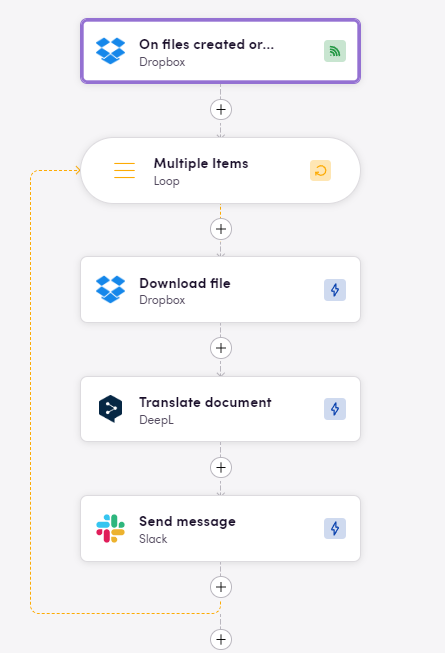

# Blackbird.io Dropbox

Blackbird is the new automation backbone for the language technology industry. Blackbird provides enterprise-scale automation and orchestration with a simple no-code/low-code platform. Blackbird enables ambitious organizations to identify, vet and automate as many processes as possible. Not just localization workflows, but any business and IT process. This repository represents an application that is deployable on Blackbird and usable inside the workflow editor.

## Introduction

<!-- begin docs -->

Dropbox is a cloud-based file hosting service that allows users to store, share, and synchronize files across different devices and platforms. It enables users to access their files from anywhere with an internet connection, making it a convenient solution for individuals, teams, and businesses to collaborate on documents, photos, videos, and other types of files.

## Connecting

1. Navigate to apps and search for Dropbox. If you cannot find Dropbox then click _Add App_ in the top right corner, select Dropbox and add the app to your Blackbird environment.
2. Click _Add Connection_.
3. Name your connection for future reference e.g. 'My Dropbox connection'.
4. Click _Authorize connection_.
5. As a new window pops up, follow the instructions from Dropbox.
6. When you return to Blackbird, confirm that the connection has appeared and the status is _Connected_.

## Actions

### Files

- **Search files** Get files list by specified path
- **Create file request** Create file request for current user
- **Copy file** Copy file from one directory to another
- **Delete file** Delete specified file
- **Download file** Download specified file
- **Get link for file download** Get temporary link for download of a file
- **Move file** Move file from one directory to another
- **Upload file** Upload file

### Folders

- **Search folders** Get folders list by specified path
- **Create folder** Create folder with a given name
- **Delete folder** Delete specified folder
- **Share folder** Share given folder

## Polling events

### Files

- **On files updated** This polling event is triggered when files are created or updated.
    - As an optional input, you can specify the parent folder to monitor so that your Birds are only triggered if files are created or updated within that one folder.
- **On files deleted** This polling event is triggered when file(s) are deleted.

## Examples

This bird fetches new or updated files from Dropbox, translates them with DeepL and then sends them to Slack channel

## Eggs

Check downloadable workflow prototypes featuring this app that you can import to your Nests [here](https://docs.blackbird.io/eggs/storage-to-mt/). 

## Feedback

Do you want to use this app or do you have feedback on our implementation? Reach out to us using the [established channels](https://www.blackbird.io/) or create an issue.

<!-- end docs -->
